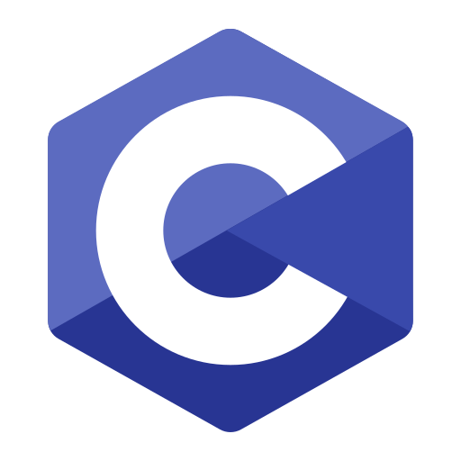
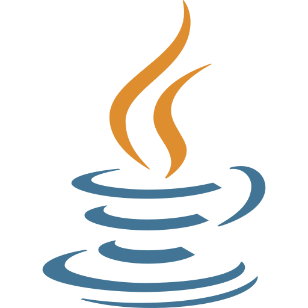

<h1 align="center">
  Hi, I'm <strong>Himanshu Maurya</strong>!
</h1>

  <strong>Full Stack Developer | PGCP-AC, IET CDAC Pune</strong> 
  ASP.NET Core • React • Java • C# • SQL 
  🏆 HackWave 2024 Winner — Sustainability & Environment Domain

---

## 👋 About Me

I am a **Full Stack Developer** and **PGCP-AC professional from IET CDAC Pune**, with a background in Computer Science & Engineering (Data Science).

Through PGCP-AC, I developed a strong foundation in **C++, Java, Data Structures & Algorithms, Database Technologies, Web Programming, Software Development Methodologies, and Microsoft .NET Technologies**.

I enjoy designing and developing **scalable, maintainable, and user-centric applications** across the frontend and backend.

### 🚀 Featured Project

**AlgoArena – Coding Practice & Interview Preparation Platform**

A full-stack coding practice and interview preparation platform developed as my **CDAC Software Project** using:

* **Frontend:** React, Vite
* **Backend:** ASP.NET Core Web API
* **ORM:** Entity Framework Core
* **Database:** Microsoft SQL Server
* **Authentication:** JWT-based authentication & role-based authorization
* **Code Execution:** JDoodle API
<!-- * **AI:** Generative AI-assisted hint generation -->

The platform allows users to learn programming concepts, solve coding problems in **C, C++, and Java**, track submissions and performance, and access learning resources such as topics, articles, and videos.

---

## 💻 Technical Skills

### Frontend

  
  
  
  
  
  

### Backend & Frameworks

  
  
  
  

**Microsoft .NET:** ASP.NET Core Web API • Entity Framework Core • C#

### Programming Languages

  
  
  
  

### Databases

  
  
  

**Primary Database Experience:** Microsoft SQL Server • MySQL • MongoDB • SQLite

### Tools & Platforms

  
  
  

---

## 📚 Core Competencies

* Full Stack Web Development
* Object-Oriented Programming
* RESTful API Development
* Database Design & SQL
* Authentication & Authorization
* CRUD & Role-Based Access Control
* Software Development Methodologies
* Problem Solving

---

## 🏆 Achievements

* 🥇 **Winner — HackWave Hackathon 2024**, APSIT
  *Sustainability & Environment Domain*
* 👨‍💻 Participated in **10+ National-Level Hackathons**
* 🎓 **PGCP-AC — IET CDAC Pune**
* 🎓 **B.E. Computer Science & Engineering (Data Science)**

---

## 🎯 Current Focus

* Building scalable full-stack applications
* Strengthening Data Structures & Algorithms
* Developing applications with **ASP.NET Core and React**
* Improving software engineering and system design skills
* Exploring **AI/ML and Generative AI**

---

## 🤝 Connect With Me

  
  
  

---

⭐ *Explore my repositories to see my projects, experiments, and learning journey.*
