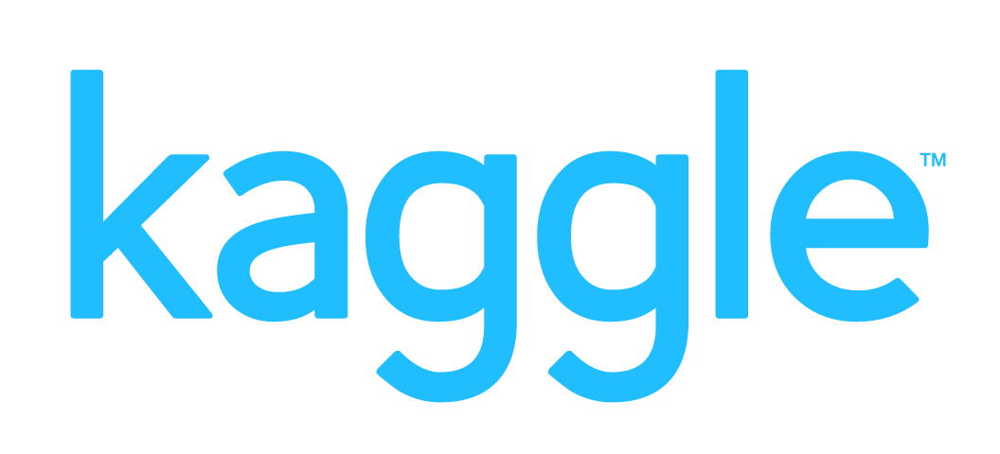

<h1 align="center">Hello 😉, I'm <strong>Himanshu Maurya</strong>!</h1>

Full-Stack Web Developer | MERN Stack | <strong>HackWave 2024</strong> (Sustainability & Environment domain)

I’m a passionate Full-Stack Developer and graduate in <strong>Computer Science and Engineering (Data Science)</strong> from <i>A. P. Shah Institute of Technology</i>, affiliated with the University of Mumbai.

I enjoy creating smart, scalable, and user-friendly applications. My portfolio includes projects like blog platforms, quiz systems, AI-based healthcare tools, and music recommendation systems.

💡 <strong>Passionate about:</strong> 
→ Full-Stack Development 
→ Open Source Contributions

<strong>Let’s connect and build something amazing!</strong>

---

🌐 [**Click here to visit my portfolio website**](https://himanshumaurya-0007.web.app)

---

## 🏆 Achievements

- 🥇 <b>Winner</b> → <i>HackWave Hackathon 2024, APSIT</i>
- 👨‍💻 Participated in <b>over 10 Hackathons</b> with diverse challenges and domains

---

## 🧑‍💻Tech Stack

<!-- Frontend -->
- Frontend

  
  
  
  
  
  

<!-- Backend -->
- Backend

  
  
  
  

<!-- Programming Languages -->
- Programming Languages

  
  
  
  

<!-- Databases -->
- Databases

  
  
  
  

<!-- Tools -->
- Tools

  
  
  

---

## 🤝 Connect with Me

  
  
  
  

---

## 📊 GitHub Stats

<!-- Add GitHub Stats (optional but highly recommended for profile visibility) -->

  
  

